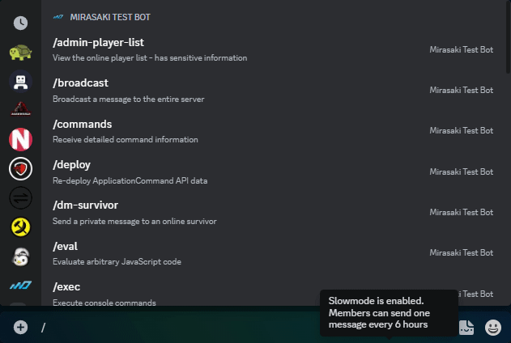
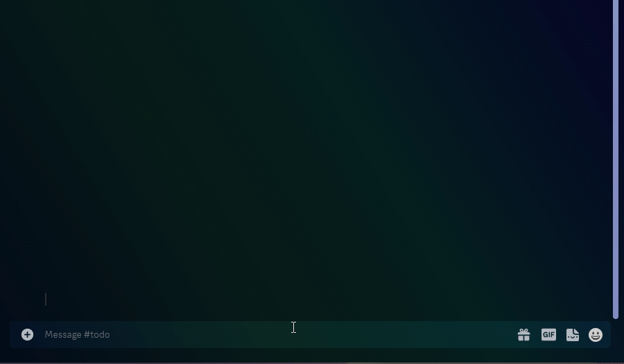
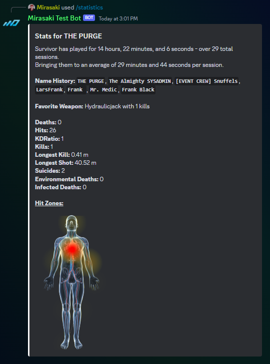
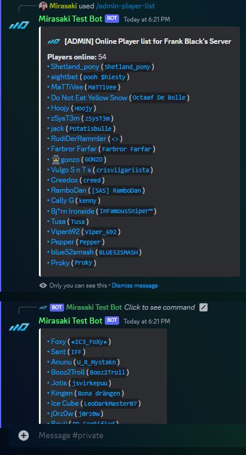
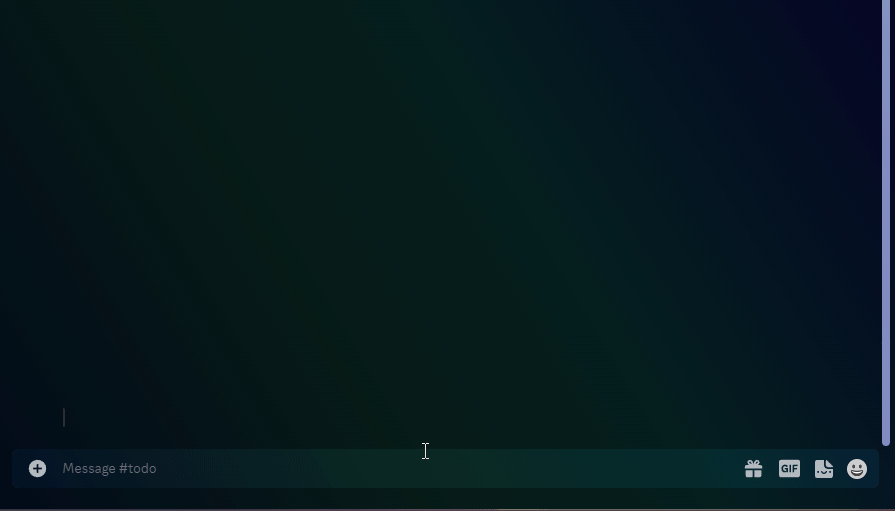
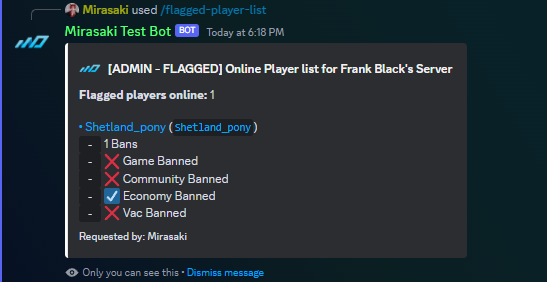
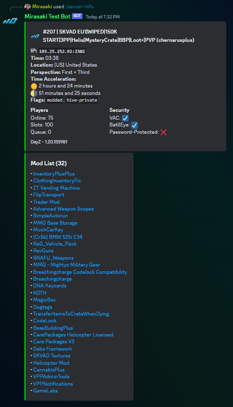

<h1 align="center">CFTools Discord Bot</h1>

A Discord bot that fully utilizes the CFTools Data API.

  
  
  
  
  
  
  <!--  -->

 
 
<h2 align="center">⭐ It's free, open-source, and self-host - meaning you're in full control</h2>

  This project was created and open-sourced by <a href="https://mirasaki.dev" target="_blank">Mirasaki Development</a>. That means it's publicly available for anyone to grab and do whatever with (MIT licensed). This project will never be monetized, every feature will always be free (keep in mind CFTools has premium endpoints). All I need to keep adding new functionality and modules is some GitHub stars. Join the absolute <strong>legends</strong> below by clicking that Star button in the top-right of your screen, it doesn't cost you anything <strong>and</strong> means the world to us ❤️

 
 

<h2 id="showcase">🎥 Showcase</h2>

Click to view

<h2 id="features">🤩 Features</h2>

- Discord > DayZ live chat feed - comes with a tag system and is **very** customizable
- Watch List - Receive role-ping notifications when a player in a custom managed list logs in
- Delayed Killfeed - Delay kill webhook messages (configurable) before forwarding them to a different/public channel
- Player Lists

  - Public list
  - Admin list with CFTools + Steam links
  - Flagged list for potential troublesome accounts/players

- User-friendly in-game player auto complete
- Broadcast messages to everyone on server
- Direct Message (private) online players
- Heal players
- Kick players
- Spawn items on players
- Teleport players
  - Comes with support for custom (autocomplete enabled) teleport locations (`/teleport-location`), instead of having to provide coordinates (still supported in `/teleport` command)
  - Teleport multiple or all to online player
  - Teleport multiple or all to customizable locations
  - Currently looking for people to contribute, we'd like a strong default configuration for users to utilize. Check out [the config file example](./config/teleport-locations/chernarus.json) and determine if you'd like to contribute, create a pull request or contact me on Discord: Mirasaki#2287
- Complete leaderboard integration with all available stats
- Display detailed player/individual statistics, supports Steam64, BattlEye GUID, and Bohemia Interactive Id
- Player hit zone % heat maps
- Server info overview
- And best of all, everything is configurable!

<h2 id="planned-features">💡 Planned Features</h2>

- Execute raw RCon commands - I'm looking for someone that is very knowledgeable on available RCon command
- Dedicated Server Status channel, overview with online/offline status
- Manage Priority Queue
- Manage Ban lists
- Manage Whitelists
- Custom GameLab action support

<h2 id="hosting">🖥️ Hosting</h2>

We have partnered with [VYKIX.com](https://portal.vykix.com/aff.php?aff=17) after observing many of our clients using VYKIX services and products. Check them out for affordable and reliable hosting, they bring the **best DayZ hosting experience possible.** 📈

<h2 id="installation">🔨 Installation</h2>

Check out [the wiki for this project](https://wiki.mirasaki.dev/docs/cftools-discord-bot) to learn how to configure and run this bot

> Open source, self-hosted, and MIT licensed, meaning you're in full control.

